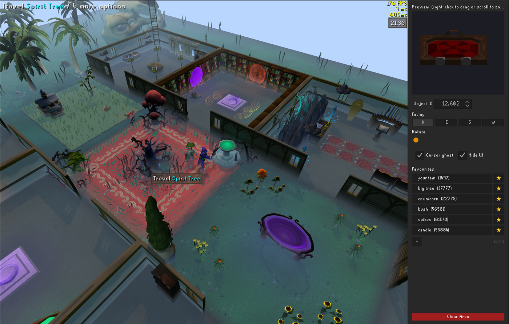
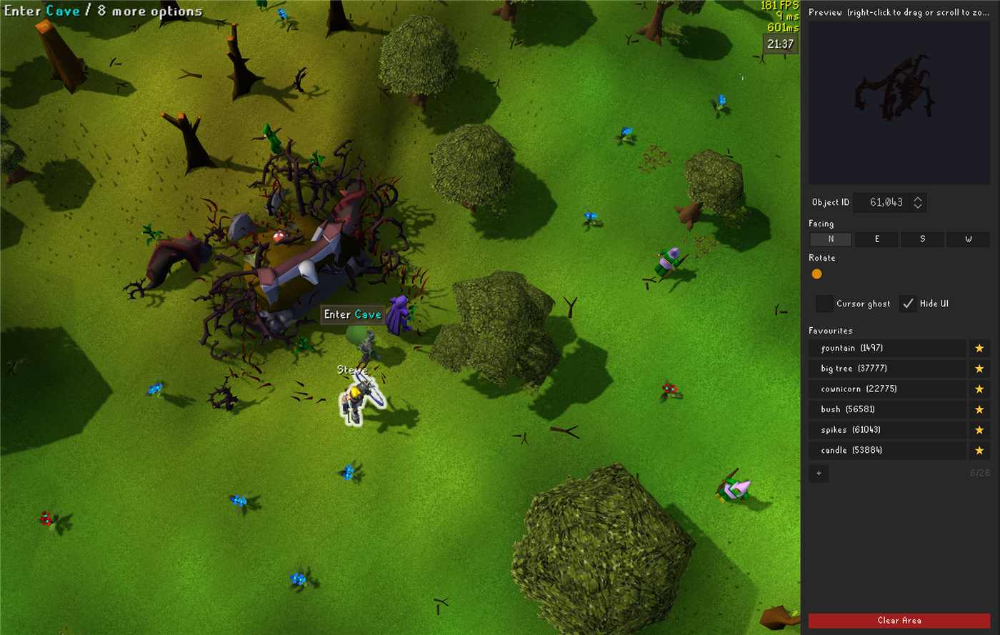

# Map Decorator

Decorate the world. Place any game object, animate it, resize it, nudge it between tiles,
populate the place with wandering NPCs, then share the whole scene with a copy-paste code.
Everything is client-side: only you see it, and nothing you place touches the game.

## Getting started

- Open the Map Decorator panel from the sidebar
- **Shift right-click any tile** and choose **Place** to put down the selected object
- Shift right-click a placed object for **Edit** and **Remove**
- Up to 3 objects can share one tile
- Everything you place is saved automatically and comes back when you log in

## Finding things to place

- **Object box**: type 2 or more letters to search every named model in the game
  ("tree", "stool", "fountain"). The arrows step through every model id, named or not.
  Not all models are named, but these can still be found with the arrow keys
- **NPC box**: search any NPC by name ("man", "guard", "huge spider") and place them as
  living decorations, true colours and idle animation included
- **Animation box**: search animated scenery by what it is ("fire", "flag"). Picking an
  animation selects its matching object automatically
- The dropdowns are keyboard friendly: arrow keys move through results, Enter picks,
  Escape closes. Whatever is highlighted is exactly what you see and what you place
- One click in any box highlights the text, so you can just type over it

## Positioning

- **Rotation**: 0 to 360 degrees, or use the N / E / S / W buttons for quick facing
- **Height**: raise or lower objects off the ground. Floating candles, sunken ruins
- **Offset X / Y**: nudge within a tile, 128 units is one full tile. Perfect for placing
  something between two tiles or flush against a wall
- **Scale**: shrink or grow anything up to double size
- Hold the arrow keys on any box to glide values, and watch the change live in the world

## The preview window

- Interactive 3D preview of your selection: drag to rotate, scroll to zoom, right-drag to pan
- Burger menu (top left) changes the backdrop: black, white, green, skybox. Remembered
  between sessions
- **Undo and redo arrows** live in the bottom corner (see Undo below)

## Editing what you've placed

- Shift right-click a placed object, choose **Edit**
- The panel loads that object's exact settings, and every control now moves the real
  object live. Nudge its height with the arrow keys and watch it rise
- **Done** (green) keeps your changes, **Cancel** (red) puts everything back as it was
- While editing, the Place option is hidden so you can't stamp accidental copies

## Bringing scenes to life

- Placed NPCs stand and idle like the real thing
- Tick the **roam checkbox** in the NPC row and placed NPCs wander up to 3 tiles from
  their spot, walking, pausing, turning around randomly
- Animated scenery (fires, flags, wheels) plays its real looping animation

## Toggles

- **Cursor ghost**: a live preview of your selection follows your mouse across the tiles
- **Be Object**: hide your player and walk the world as your selected object or NPC.
  NPCs even play their real walking animation as you move
- **Hide UI**: clears the whole interface for clean screenshots
- **Hide Menu**: removes the plugin's right-click options, so the game feels untouched

## Undo and redo

- The arrow buttons on the preview undo and redo up to 50 steps
- Covers placing, removing, edits, imports, Clear Area, and even a misclicked favourite
  that overwrote your selection
- Cleared an entire area by accident? One click brings it all back

## Favourites

- Save your current setup to a named slot with the star button
- A favourite stores the complete recipe: object or NPC, animation, rotation, height,
  offsets, scale, roam
- Left-click to load, right-click to remove a slot, and grow the list up to 28 slots

## Sharing

- **Export Nearby** copies everything within 100 tiles to your clipboard as a single code
- Send it to a friend; they stand in the same place, copy it, and press **Import**
- Imports skip duplicates and never overwrite a full tile

## Player-owned house

- Everything works in the POH too, saved per account

## Tips

- **Copy a placed object**: Edit it, then immediately press Done. Its full recipe stays
  loaded in the panel, ready to stamp duplicates
- Use tab and shift-tab when editing an object to go up and down the menu quickly
- Search "fire" in the Animation box for the classic campfire
- Negative height sinks objects into the floor for ruins and half-buried props
- Be Object plus a scaled-up spider is a personality statement

## Good to know

- Client-side only: nobody else sees your decorations, and gameplay is unaffected
- Objects are visual only, they have no collision and can't be interacted with
- Very large NPCs may clip terrain when placed or scaled
- Decorations follow your RuneLite profile

Found a bug or have a suggestion? Open an issue here on GitHub.
