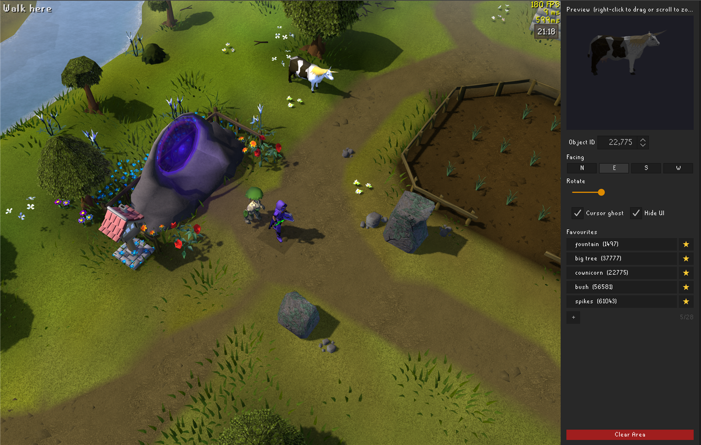

# Map Decorator

A RuneLite plugin for creative players that enjoy world building.

Map Decorator allows you to rotate and place any OSRS object into the world, so you can beautify your favourite area in Gielinor — fill the forests, plant more flowers in your own garden, or decorate your POH (house placements are saved and restored every visit).

Everything is client-side only. You cannot edit or move any already in-game objects, only you can see your placements, and nothing is ever sent to the server — keeping it safe to use. Your decorations are saved and come back whenever you return to the area.

There are over 60,000 objects, unnamed, and ranging through the different eras of the game (unfortunately there's no way to map their names to the object IDs that RuneLite returns — half the fun is finding out what's hiding behind a number). You can stack up to 3 objects on a single tile, remember up to 28 favourite object IDs, and place and decorate as many objects in different places as you like.

## User tips

- Holding shift + right-clicking on any tile while the plugin is active will allow you to place, rotate or remove an object. Rotating an object will "select" that object — so you can find the IDs of objects you previously placed.
- You can cycle through the objects quickly by using the Cursor Ghost: click on the Object ID number and use the up and down arrows to go through the numbers, and if you move your mouse to the game screen you can view the models at your cursor as you cycle.
- The Hide UI tickbox hides the game HUD for clean screenshots, and fades it back in when unticked.
- Clicking the red Clear Area button will open a confirmation box to clear every object in the map area currently loaded around you. Anything not in that area, like another dungeon or your PoH, will remain.

I've been having so much fun decorating random rooms and dungeons throughout the game as I've been developing it, and I hope you do too.

Please let me know if you find any bugs or have any suggestions to improve — open an issue here on GitHub.
