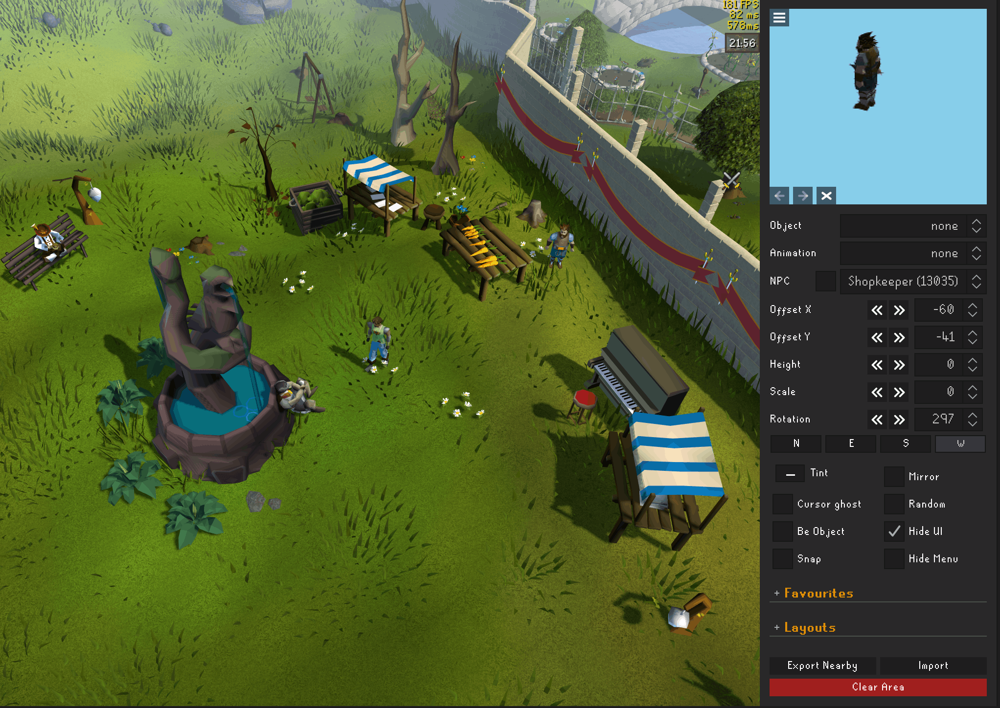

# Map Decorator

Place any object or NPC in the game, anywhere. Client-side only — nobody else sees it, and nothing you place touches the server.

## Basics

- Open the panel from the sidebar
- **Shift right-click a tile → Place**
- Shift right-click a placed object for **Edit** and **Remove**
- 3 objects per tile
- Saves automatically, comes back on login

## Finding things

- **Object** — type 2+ letters to search every named model ("tree", "stool", "fountain"). Arrows step through 70,000 model ids, named or not
- **NPC** — search by name ("guard", "cat"). Places with correct colours and idle animation
- **Animation** — search by what the thing is ("cow", "flag"). Picking one auto-selects its object
- Arrow keys move, Enter picks, Escape closes. Whatever's in the preview is what you get

## Placing

- Objects land **exactly where you clicked** within the tile, not snapped to the centre
- **Snap** — turn that off, back to dead-centre. Good for walls and fences
- **Random** — randomises rotation and mirror on every placement. For scattering trees and rocks without doing it by hand

## Adjusting

- **Rotation** — 0–360°, wraps past either end. `«` `»` turn 90° a click. N/E/S/W for absolute facing
- **Height** — raise or sink. Floating candles, half-buried ruins
- **Offset X/Y** — nudge within the tile, 128 units is a full tile
- **Scale** — shrink to nothing or grow to double
- **Tint** — recolour anything. Opacity slider is the strength
- **Mirror** — flip left-to-right
- `«` `»` jump to min/max; click again to return to 0
- Hold an arrow key to glide a value and watch it move live

## Preview

- Drag to rotate, scroll to zoom, right-drag to pan
- Burger menu changes the backdrop. Remembered between sessions
- Undo, redo and reset sit in the bottom corner

## Editing

- Shift right-click → **Edit**. The panel loads that object's exact settings
- Every control now moves the real object live
- **Done** keeps it, **Cancel** puts it back
- Place is hidden while editing, so you can't stamp accidental copies

## Making it move

- Placed NPCs stand and idle properly
- Tick **roam** and they wander up to 3 tiles, walking and pausing and turning around
- Animated scenery plays its real looping animation

## Toggles

- **Cursor ghost** — live preview of your selection follows the mouse
- **Be Object** — hide your player and walk around as the selected object or NPC, walk animation included. Pick something that flies and you fly
- **Hide UI** — clears the interface for screenshots (resizable mode)
- **Hide Menu** — removes the plugin's right-click entries so the game feels untouched

## Undo

- 50 steps, on the preview arrows
- Covers placing, removing, edits, imports, Clear Area, and misclicked favourites
- Cleared an area by accident? One click

## Favourites and Layouts

- **Favourites** — star button saves the whole recipe: object or NPC, animation, rotation, height, offsets, scale, tint, mirror, roam. Left-click loads, right-click renames or removes
- **Layouts** — named export/import codes kept between sessions, so you can rebuild a scene later or hand it to someone

## Sharing

- **Export Nearby** copies everything within 100 tiles as one code
- They go to same place and press **Import**
- Duplicates are skipped, full tiles are never overwritten

## Player-owned houses

- Works the same inside a POH, saved per account
- Rooms are matched by their furniture, so an imported layout only lands in rooms that actually match. A differently built house gets a partial fit or nothing
- Objects on other floors stay hidden until you're on that floor

## Tips

- **Duplicate an object**: Edit it, press Done. The recipe stays loaded, ready to stamp
- Tab and shift-tab move through the panel while editing
- Negative height sinks things into the floor for ruins
- Random plus a handful of trees fills space faster than placing them one at a time

## Good to know

- Client-side only. Nobody else sees any of it and gameplay is unaffected
- Decorations are visual — no collision, can't be clicked
- Very large NPCs can clip terrain
- Saved against your RuneLite profile

Bug or suggestion? Open an issue.
